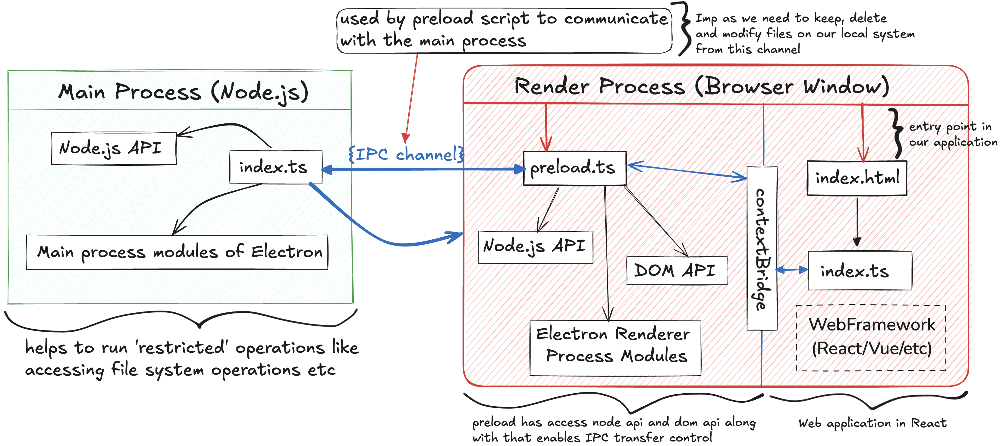

# NoteDrop

NoteDrop is a simple mark-down app just like AppleNotes but built with Electron, React, and Typescript.

## Tech Stacks currently used

Electron, React, Typescript, TailwindCSS, MDXEditor, tailwind-merge, clsx, tailwindcss-typography

## General Project Overview

```bash
└── 📁md-notes
    └── 📁.vscode
        └── extensions.json
        └── launch.json
        └── settings.json
    └── 📁build
        └── entitlements.mac.plist
        └── icon.icns
        └── icon.ico
        └── icon.png
    └── 📁resources
        └── icon.png
        └── NoteDrop_Structure.png
    └── 📁src
        └── 📁main
            └── 📁lib
            └── index.ts
        └── 📁preload
            └── index.d.ts
            └── index.ts
        └── 📁renderer
            └── 📁src
                └── 📁store  # jotai state manager will store all the atoms used for managing their internal state
                └── 📁hooks  # used for storing all the custom hooks
                └── 📁utils  # used for storing all the utility functions that I will use throughout the app
                └── 📁assets
                    └── index.css
                └── 📁components
                    └── index.ts
                └── App.tsx
                └── env.d.ts
                └── main.tsx
            └── index.html
        ├── 📁shared  # contains the configuration files, function, types that are shared between the main and renderer process
    └── .DS_Store
    └── .editorconfig
    └── .eslintignore
    └── .eslintrc.cjs
    └── .gitignore
    └── .prettierignore
    └── .prettierrc.yaml
    └── electron-builder.yml
    └── electron.vite.config.ts
    └── package-lock.json
    └── package.json
    └── README.md
    └── tsconfig.json
    └── tsconfig.node.json
    └── tsconfig.web.json
```

## Working Background



## Project Setup

### Install

```bash
npm install
```

```bash
npm run dev
```

### Build

```bash
# For windows
npm run build:win

# For macOS
npm run build:mac

# For Linux
npm run build:linux
```
